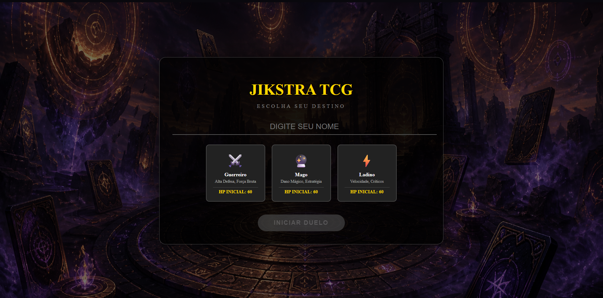
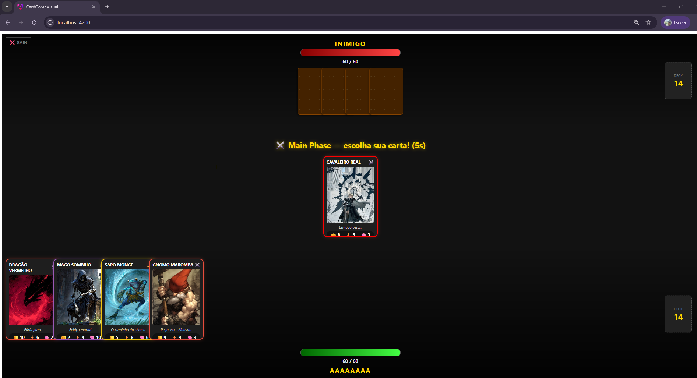

# Jikstra TCG

> Card game de duelo em turnos com sistema de tipos e IA adversária, construído com Angular 21.




## Sobre o Projeto

Jikstra TCG é um jogo de cartas digital onde o jogador enfrenta uma IA em duelos por turnos. Cada carta possui três atributos — **Força**, **Velocidade** e **Magia** — que se relacionam em um sistema de vantagens cíclicas (semelhante ao pedra-papel-tesoura). O jogador escolhe sua classe, compra cartas do deck e seleciona qual jogar a cada rodada antes que o tempo acabe.

Todas imagens utilizadas no projeto foram geradas por inteligencia Artficial.

## Tecnologias

- **Angular 21** — standalone components, SSR via Express / `@angular/ssr`
- **TypeScript 5.9**
- **RxJS 7.8**
- **SCSS**
- **Vitest** — testes unitários

## Sistema de Jogo

**Classes disponíveis**
| Classe | Estilo |
|---|---|
| Guerreiro | Alta Defesa, Força Bruta |
| Mago | Dano Mágico, Estratégia |
| Ladino | Velocidade, Críticos |

**Triângulo de tipos**
Força > Velocidade > Magia > Força

**Fases por rodada**
1. **Draw Phase** — ambos compram uma carta do deck
2. **Main Phase** — jogador tem 30s para escolher sua carta; IA escolhe em 1s
3. **Battle Phase** — cartas são comparadas e o perdedor perde 10 HP
4. **End Phase** — campo é limpo, próxima rodada começa

O deck é gerado com **Fisher-Yates shuffle**. Se o deck esgotar, um novo é gerado automaticamente.

## Como Rodar

```bash
# Instalar dependências
npm install

# Servidor de desenvolvimento
ng serve
```

Acesse `http://localhost:4200/`.

```bash
# Build de produção
ng build

# Testes
ng test
```

**Dica:** pressione `Ctrl+D` durante o jogo para abrir o painel de debug com o log de rodadas em tempo real.

## Estrutura

src/
└── app/
├── app.component.ts   # Lógica principal: fases, combate, IA, deck
├── app.component.html # Template do jogo e tela de login
├── app.component.scss # Estilos
└── card/
└── card.ts        # Componente e interface de carta
